<div align="center">

  <h1 style="font-size: larger;">
    
    <strong> Arbitrum Nitro: Guía para correr un full node</strong> 
    
  </h1>

</div>

## Introducción
Los Rollups, al igual que cualquier blockchain, operan en función de un nodo completo. En una blockchain de capa 1, el nodo completo representa la unidad fundamental que impulsa la seguridad y descentralización de la red. Para el usuario individual, proporciona accesibilidad, soberanía y privacidad al interactuar con la red. En un Optimistic Rollup completamente funcional, la noción de un "nodo completo" no ofrece el mismo nivel de beneficios desde la perspectiva de la red, debido a que no sigue la misma lógica de a mayor cantidad de nodos mayor confianza como la L1. Sin embargo, sigue siendo una fuente valiosa de ventajas desde la perspectiva del usuario, y ofrece otras propiedades igualmente importantes.

En Arbitrum, los usuarios tienen la opción de ejecutar un nodo de la red, lo que implica tener una copia completa del rollup en forma de nodo completo o nodo archivo. Además, tanto los productores de bloques (secuenciadores) como aquellos encargados de proponer nuevas transiciones de estado (validadores) deben operar una versión de nodo completo que abarque todas sus responsabilidades en el proceso.

Si deseas explorar con mayor profundidad los roles y responsabilidades de estos participantes en Arbitrum, te recomendamos que leas este [artículo](https://mirror.xyz/layer2es.eth/L0YiPok0FymbnHZyA5GqbKL4OL0U4jBDwTuTGzD4PiE). Te proporcionará una comprensión más completa de cómo funcionan estos agentes en la red.

Como comentamos anteriormente, existen diversas razones para considerar la ejecución de un nodo completo de Arbitrum:

* **Verificación Independiente del Estado del Rollup:** Esto permite detectar transiciones de estado inválidas de manera local e independiente. Esta propiedad es independiente de si el mecanismo de pruebas de fraude está habilitado o no.

* **Acceso al Estado Actual o Anterior:** Los usuarios pueden acceder al estado actual o anterior del rollup, lo que les permite solicitar información o interactuar con la red sin depender de servicios de terceros.

* **Ineracción Directa en la L2:** Los usuarios pueden interactuar directamente en la capa 2 (L2) e incluso generar pruebas locales para realizar retiros e incluir transacciones de manera autónoma.

* **Persistencia de los datos:** Los usuarios tienen acceso al historial del rollup. Esto cobrará más importancia luego de implementarse la [EIP-4844](https://eips.ethereum.org/EIPS/eip-4844).

Cualquier proveedor de infraestructura en la red Arbitrum, como exploradores, puentes, keepers e indexadores, opera directamente o depende de un nodo completo. **Esto demuestra la importancia de ejecutar y mantener un nodo completo para contribuir al funcionamiento eficiente de la red y aprovechar todas sus capacidades.**

---

## ¿Cómo correr un full node de Arbitrum Nitro?

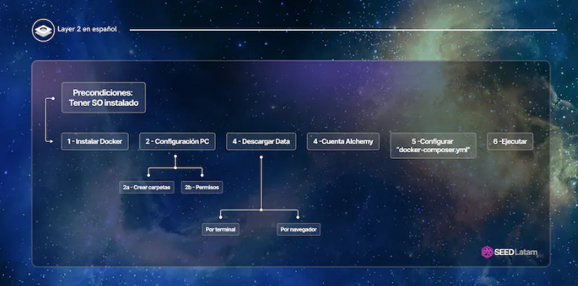

A continuación encontrarás la información necesaria para configurar un nodo completo de Arbitrum Nitro en tu casa. Recorreremos el camino desde las precondiciones hasta la configuración del docker, de la forma más simple posible.

---

## 1. Precondiciones

### 1.a. Hardware mínimo necesario:
En esta sección, detallamos los requisitos de hardware mínimos necesarios para configurar un nodo completo de Arbitrum Nitro (no es un nodo de archivo) de manera efectiva. Para garantizar un funcionamiento óptimo, se recomienda contar con al menos la siguiente configuración:

- RAM: 8-16 GB
- CPU: 2-4 núcleos
- Almacenamiento: Mínimo 1.2 TB SSD (asegúrese de que sea posible agregar más espacio)
- Tasa de crecimiento estimada: Aproximadamente 3 GB por día

Es importante tener en cuenta que estos requisitos mínimos de almacenamiento pueden cambiar con el tiempo a medida que la red Nitro crece. Por lo tanto, se aconseja utilizar hardware que supere estos requisitos mínimos para ejecutar un nodo completo de manera eficiente.

### 1.b. Herramientas Necesarias:
Para configurar el nodo, necesitarás la siguiente herramienta:

- Última imagen de Docker: offchainlabs/nitro-node:v2.0.14-2baa834
Esto dependerá del sistema operativo de tu computadora. Te recomendamos consultar la documentación de Docker y seguir los pasos correspondientes para tu sistema. Por ejemplo, si utilizas Ubuntu, puedes consultar la guía en https://docs.docker.com/engine/install/ubuntu/.

Antes de comenzar, es crucial asegurarse de tener el Docker instalado en tu sistema. Si ya lo tienes instalado, desinstálalo y asegúrate de tener la última versión. Para verificar que la instalación se realizó correctamente, puedes ejecutar el siguiente comando en tu terminal:

```bash
sudo docker run hello-world
```

Si recibes un mensaje de confirmación, la instalación de Docker se completó con éxito.

---

## 2. Configuración de tu PC
Para esta etapa, se recomienda descargar Visual Studio Code, ya que facilita la visualización de carpetas y la apertura de múltiples terminales.

### 2.a Creación de Carpetas y Archivos:
- Abrí Visual Studio Code y dirígete a File > Open Folder > Filesystem.

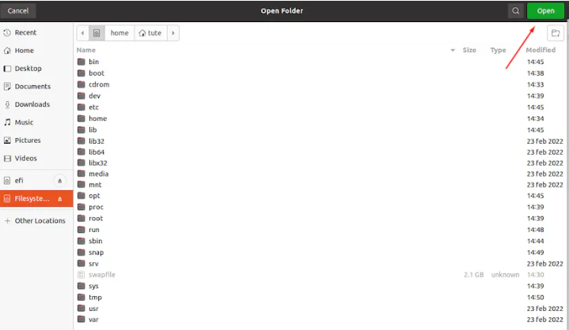

- Abrí una nueva terminal en VS Code.

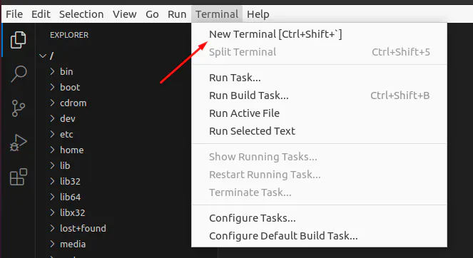

- Navega hasta la carpeta "home" y crea una carpeta llamada "user" dentro de ella. Si encuentras problemas de permisos, puedes utilizar el siguiente comando dentro de /home:

```bash
sudo chmod 777 /home
```

- A continuación, crea una carpeta llamada ".arbitrum" dentro de la carpeta "user". La dirección de esta carpeta será: home/user/.arbitrum.

Para crear estas carpetas utilizando la terminal, el camino sería el siguiente:

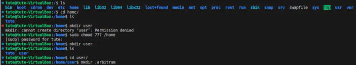

La dirección de la carpeta quedaría en: **home/user/.arbitrum.**

Recarga el explorador en VS Code para visualizar las carpetas recién creadas.

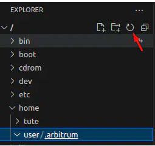

Dentro de la carpeta principal, dirígete a la carpeta "**user**" y luego a "**local**", donde crearás otra carpeta llamada "arbitrum". Si experimentas problemas de permisos para crear la carpeta "arbitrum", puedes usar nuevamente el comando "sudo chmod" mencionado anteriormente.

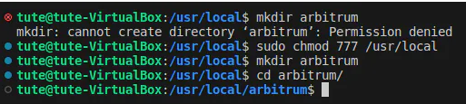

Dentro de /arbitrum, crea un nuevo archivo llamado "**docker-compose.yml**". Puedes hacerlo fácilmente desde VS Code. La dirección de esta carpeta será: **/usr/local/arbitrum/docker-compose.yml.**

### 2.b Permisos:
La imagen de Docker está configurada para ejecutarse como un usuario no root con UID 1000. Esto significa que si estás utilizando Linux u OSX y encuentras errores de permisos al intentar ejecutar la imagen de Docker, deberás ejecutar el siguiente comando para permitir que todos los usuarios actualicen las carpetas persistentes. Asegúrate de estar dentro de la carpeta "usr/local/arbitrum" al ejecutar este comando en la terminal:

```bash
chmod -fR 777 arbitrum
```

Con esto, hemos otorgado al Docker permisos de escritura en nuestro directorio. Aún no utilizaremos el archivo, ya que iremos agregando contenido gradualmente.

---

## 3. Descargar un Snapshot de Arbitrum
Ahora vas a proceder a descargar los datos históricos de la blockchain de Arbitrum y los ubicarás en la carpeta /usr/local/arbitrum.

Es importante que te asegures de estar en la carpeta /usr/local/arbitrum utilizando el comando "cd". Se recomienda realizar la descarga mediante la terminal, ya que si se produce algún error de conexión (lo cual es posible), la terminal realizará automáticamente la solicitud para reanudar la descarga.A continuación, procederemos a descargar los datos históricos de la blockchain de Arbitrum. Estos datos se almacenarán en la carpeta /home/user/.arbitrum.

Podés realizarlo de 2 formas:

### 3.a. A través de la terminal:
Asegúrate de estar ubicado en la carpeta **/home/user/.arbitrum** antes de ejecutar este comando. Puedes navegar a esta carpeta utilizando el comando "cd" (change directory)

```bash
wget https://snapshot.arbitrum.foundation/arb1/nitro-pruned.tar
```

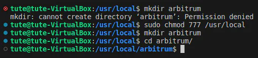

### 3.b. Por medio de un navegador web:
Deberías identificar el archivo llamado "**nitro-pruned.tar**" y descargarlo desde [aquí](https://snapshot.arbitrum.foundation/index.html).

En pantalla vas a ver lo siguiente:

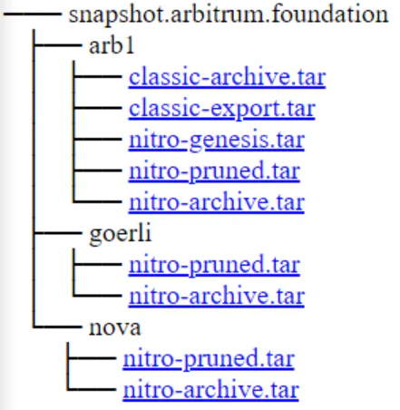

**Aclaración:** Al momento de escribir esta guía, el tamaño del archivo es de alrededor de 310 GB.

---

## 4. Parámetros requeridos
El siguiente paso implica obtener un URL RPC de Ethereum para la Capa 1. Debes proporcionar la siguiente información:

```bash
-l1.url=<Layer 1 Ethereum RPC URL>
```

Este parámetro requiere un enlace RPC de nodo estándar de Layer 1 que esté en funcionamiento, ya sea uno que administres tú mismo o que provenga de un proveedor de nodos confiable (si quisieras también correr tu propio nodo de Ethereum, podés revisar la guía creada por SeedLatam [aquí](https://mirror.xyz/seedlatam.eth/VpuKM5vy2uWpK-H-MVGcbZaCIlRVoC3iTsASDDXIhTY)).

```bash
-l2.chain-id=<L2 Chain ID>
```

Para obtener el URL necesario, en esta guía aprenderás cómo conectarte a un nodo proporcionado por Alchemy, uno de los principales proveedores de nodos en la red. Esto te permitirá obtener los recursos necesarios para continuar con la configuración.

Con estos pasos, estarás en camino de configurar tu propio nodo completo de Arbitrum Nitro de manera efectiva y contribuir al fortalecimiento de la red.

---

## 5. Cómo conectarse a un Nodo de Ethereum en Alchemy
Aquí tienes una guía paso a paso sobre cómo puedes conectarte a un nodo de Ethereum utilizando Alchemy como tu proveedor de nodo para conectarlo a tu nodo de Arbitrum:

### Paso 1: Registro en Alchemy
Tu primer paso consiste en dirigirte al sitio web de [Alchemy](https://www.alchemy.com/) para registrarte y proporcionar algunos detalles. Si ya te habías registrado anteriormente, simplemente inicia sesión.

### Paso 2: Creación de una Nueva Aplicación de Ethereum
Dirígete a la sección de "**Aplicaciones**" en el menú izquierdo y haz clic en el botón "**Crear nueva aplicación**". Luego, selecciona lo siguiente:

- **Cadena:** Ethereum

- **Red:** Ethereum Mainnet

- **Nombre:** [Elige un nombre]

- **Descripción:** [Elige una descripción]

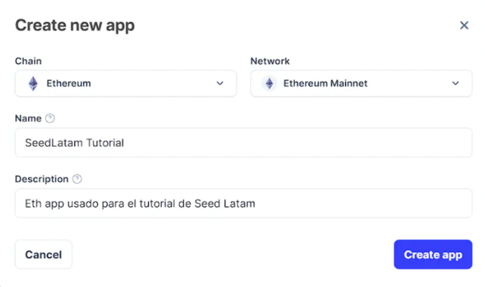

Una vez configurado, haz clic en "**Crear aplicación**". Regresa a la página de inicio, donde encontrarás la aplicación recién creada.

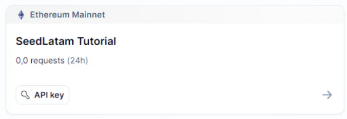

Haz clic en "**API key**" (la clave del API) y guarda el código HTTPS que necesitarás en el Paso 5: Configuración del Docker.

## Configuración del docker
Dirígete a **/home/usr/local/arbitrum/docker-compose.yml** y pega el siguiente contenido:

```bash
version: '3.3' 
services:
nitro-node:
network_mode:host 
image: 'offchainlabs/nitro-node:v2.0.14-2baa834' 
user: 1000:1000 
restart: always 
stop_grace_period: 30s 
volumes: 
# localPath : containerPath 
- '/usr/local/arbitrum:/home/user/.arbitrum' 
ports:
- '0.0.0.0:8547:8547' 
- '0.0.0.0:8548:8548' 
command: 
- --init.url=file:///home/user/.arbitrum/nitro.tar 
- --l1.url=https://eth-mainnet.g.alchemy.com/v2/4FMFgbhtdTwvS-Mtt1V7PfUqh_CwYRN4 
- --l2.chain-id=42161 
- --http.api=net,web3,eth,debug 
- --http.corsdomain=* 
- --http.addr=0.0.0.0 
- --http.vhosts=* 
logging: 
driver: json-file 
options: 
max-size: 10m 
max-file: "10"
```

**Observación Importante:** Cuando escribas el archivo manualmente, asegúrate de agregar espacios desde el comienzo de cada línea en lugar de usar tab, ya que el archivo podría no ser leído correctamente.

**Asegúrate de guardar el archivo después de pegar (Ctrl+S).**

**Consideraciones importantes:**

* Es fundamental que el parámetro image: '**offchainlabs/nitro-node:v2.0.14-2baa834**' coincida con la versión especificada en la documentación de Arbitrum. Ten en cuenta que esta versión puede cambiar con el tiempo, por lo que debes verificar la versión actual en la documentación de Arbitrum y utilizar la que esté publicada allí.

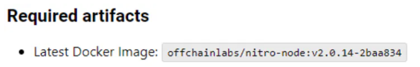

En **l2.chain-id**, debes asignar el valor **42161**, ya que la documentación de Arbitrum indica que ese es el Chain ID de Arbitrum One.

### Endpoints de RPC Públicos

Esta tabla proporciona una visión general de los endpoints de RPC públicos disponibles para diferentes cadenas de Arbitrum y los detalles necesarios para interactuar con ellos.

| Nombre               | URL de RPC                           | ID de Cadena | Explorador de Bloques                   | Cadena Subyacente | Tecnología Utilizada | URL de Feed del Secuenciador                   | Endpoint del Secuenciador⚠️                           |
|----------------------|--------------------------------------|--------------|----------------------------------------|-------------------|----------------------|--------------------------------------------|-----------------------------------------------------|
| Arbitrum One         | https://arb1.arbitrum.io/rpc         | 42161        | https://arbiscan.io/                   | Ethereum          | Nitro (Rollup)       | wss://arb1.arbitrum.io/feed                 | https://arb1-sequencer.arbitrum.io/rpc              |
| Arbitrum Nova        | https://nova.arbitrum.io/rpc        | 42170        | https://nova.arbiscan.io/              | Ethereum          | Nitro (AnyTrust)     | wss://nova.arbitrum.io/feed                | https://nova-sequencer.arbitrum.io/rpc             |
| Arbitrum Goerli (Testnet) | https://goerli-rollup.arbitrum.io/rpc | 421613  | https://goerli.arbiscan.io              | Goerli            | Nitro (Rollup)       | wss://goerli-rollup.arbitrum.io/feed        | https://goerli-rollup-sequencer.arbitrum.io/rpc    |
| Arbitrum Sepolia (Testnet) | https://sepolia-rollup.arbitrum.io/rpc | 421614 | https://sepolia-explorer.arbitrum.io/  | Sepolia           | Nitro (Rollup)       | wss://sepolia-rollup.arbitrum.io/feed       | https://sepolia-rollup-sequencer.arbitrum.io/rpc  |
| Stylus Testnet       | https://stylus-testnet.arbitrum.io/rpc| 23011913    | https://stylus-testnet-explorer.arbitrum.io/ | Arbitrum Sepolia | Nitro (Rollup)       | wss://stylus-sepolia.arbitrum.io/feed       | https://stylus-testnet-sequencer.arbitrum.io/rpc |


**El puerto en el que se ejecutará el RPC es 8547.**

---

## 6. Ejecutando el Nodo (Putting it all together)
Ahora que has preparado la PC y configurado el Docker, es hora de ejecutar tu nodo de Arbitrum. Sigue estos pasos con atención para asegurarte de que todo funcione sin problemas.

Para iniciar el nodo, dirígete a la terminal y navega hasta /usr/local/arbitrum, luego ejecuta el siguiente comando:

```bash
sudo chmod 666 /var/run/docker.sock
```

Este comando te permitirá ejecutar los comandos de Docker que necesitas. A continuación, ejecutaras el comando principal para iniciar el nodo:

```bash
docker run --rm -it -v /usr/local/arbitrum:/home/user/.arbitrum 
-p 0.0.0.0:8547:8547 -p 0.0.0.0:8548:8548 offchainlabs/nitro-node:v2.0.14-2baa834 
--l1.url https://eth-goerli.g.alchemy.com/v2/b-CFpogLW7ZBL5idfoWOF3Tm5hI4OMk_ 
--l2.chain-id=421613 
--http.api=net,web3,eth,debug 
--http.corsdomain=* 
--http.addr=0.0.0.0 
--http.vhosts=*
```

Este es el desglose de los parámetros del comando:

- `-docker run --rm -it -v /usr/local/arbitrum:/home/user/.arbitrum`

- `-p 0.0.0.0:8547:8547 -p 0.0.0.0:8548:8548 offchainlabs/nitro-node:v2.0.14-2baa834`

- `--l1.url https://eth-goerli.g.alchemy.com/v2/b-CFpogLW7ZBL5idfoWOF3Tm5hI4OMk_`

- `--l2.chain-id=42161`

- `--http.api=net,web3,eth,debug`

- `--http.corsdomain=*`

- `--http.addr=0.0.0.0`

- `--http.vhosts=*`

Esto es una versión acortada del archivo de Docker que configuraste anteriormente, vas a tener que reemplazar los parámetros por tus valores. Al parámetro **chain-id** lo debes dejar en **4261** si estas en mainnet (Ver la tabla del paso anterior donde se indica el **Chain ID** dependiendo de la red a la cual nos queremos conectar).

Es importante que reemplaces el **url** de la **L1** que obtuviste en **Alchemy.** Una vez que hayas reemplazado los parámetros necesarios con tus propios valores, ejecuta el comando.

Vas a ver la siguiente imagen en pantalla:

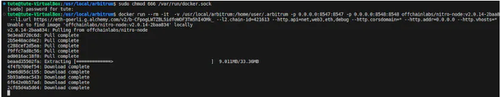

### 6.a Verificación del Nodo
Si puedes ver información como se muestra en la imagen, ¡Felicitaciones, tu nodo está funcionando correctamente!

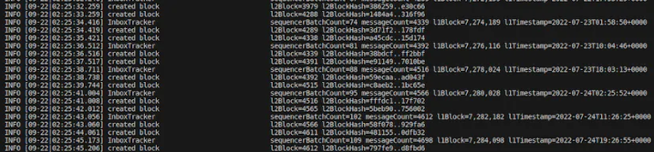

### 6.b Detener el nodo
Para detener el nodo, abrí otra terminal y ejecuta el siguiente comando:

```bash
docker stop --time=300 $(docker ps -aq)
```

Este comando asegura un apagado ordenado de todas las imágenes de Docker en ejecución. Al apagar una imagen de Docker, es importante permitir un cierre ordenado para que el estado actual pueda ser guardado en disco.

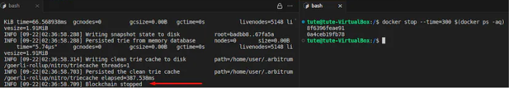

## 6.c Probando comandos
Ahora vas a volver a levantar el Nodo utilizando el siguiente comando:

```bash
docker compose up 
```

(este comando utiliza el archivo que creaste en **docker-compose.yml**)

Así verás que tu nodo esta funcionando nuevamente y de forma correcta:

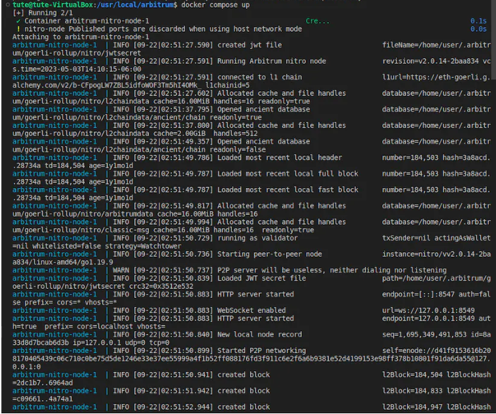

---

## 7. Adicional
Puedes enviar varios comandos al nodo una vez que esté en funcionamiento. Consulta la [documentación de Ethereum](https://ethereum.org/en/developers/docs/apis/json-rpc/#json-rpc-methods) para obtener una lista de métodos que puedes utilizar.

También, si deseas probar comandos, puedes utilizar [Postman.](https://www.postman.com/hyperledger/workspace/hyperledger-besu/overview) (shout out Juanu por el link)

De querer obtener algún dato en particular, podés utilizar los comandos que brinda la documentación de Ethereum, por ejemplo el blockNumber actual:

Vas a dirigirte a Postman y realizamos el post, se debe hacer desde la misma pc desde donde corre al nodo:

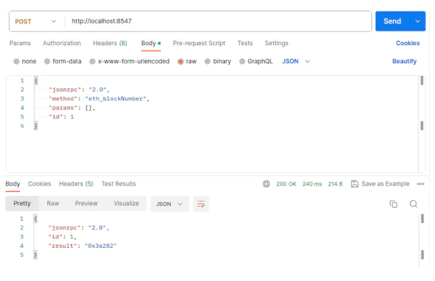

---

## Conclusión
En resumen, con esta guía contarás con la información necesaria para correr tu propio nodo completo de Arbitrum y contar con la capacidad de verificar transacciones de forma independiente y con menos requisitos de confianza lo que termina fomentando la accesibilidad de la red.

Los recursos requeridos para un nodo completo son accesibles y su configuración, aunque técnica, es alcanzable para aquellos con conocimientos básicos de desarrollo Web3. Los pasos que hemos delineado, desde otorgar permisos del Docker y su configuración hasta la descarga del snapshot y ejecución del nodo, son el camino hacia la autonomía y la contribución activa a la resistencia de Arbitrum.

Además, al interactuar directamente con la L2 y tener acceso al estado de la red, podrás presenciar de primera mano los resultados de tu contribución al ecosistema.

Si consideras la soberanía, la resistencia a la censura y la accesibilidad como conceptos fundamentales, la ejecución de un nodo completo se convierte en un acto poderoso.

¡Es hora de correr tu propio nodo y formar parte del ecosistema activamente!
