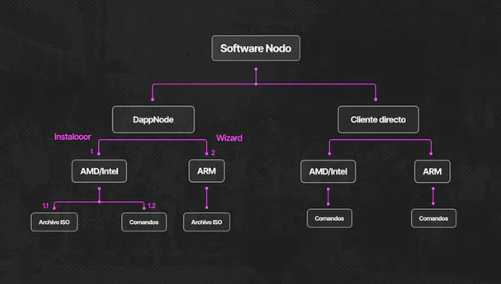
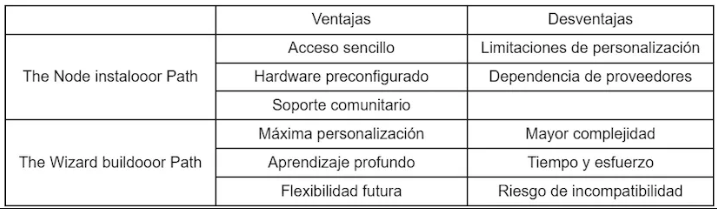
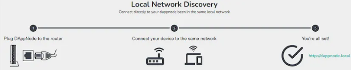
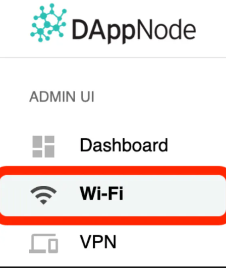
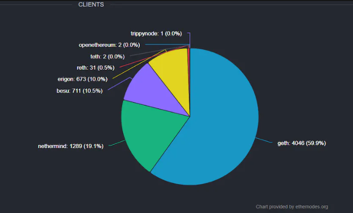
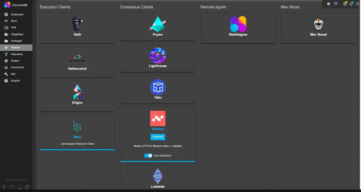
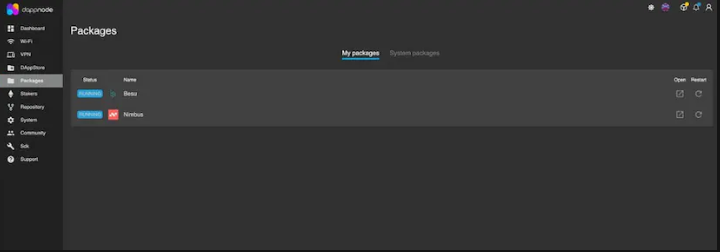

<div align="center">

  <h1 style="font-size: larger;">
    
    <strong> Guía completa para configurar un nodo de Ethereum: Desde la instalación hasta la sincronización</strong> 
    
  </h1>

</div>

## Introducción
Ethereum opera como una red distribuida de nodos, cada uno de los cuales ejecuta el software para verificar los bloques de la cadena. La correcta distribución de estos nodos es esencial para lograr la descentralización y aumentar la resistencia a la censura de la red. Un ejemplo de esto es un nodo operando en Córdoba, Argentina, lo que representa un significativo avance hacia la mejora de la integridad de la red. Por lo tanto, es crucial motivar a más personas en América Latina a embarcarse en la tarea de ejecutar sus propios nodos, contribuyendo así de manera directa a una blockchain más descentralizada y robusta.

En este artículo, te proporcionaremos una guía completa para configurar tu propio nodo de Ethereum. Si sientes que aún necesitas perfeccionar algunos conceptos antes de comenzar, también hemos elaborado el artículo “Artículo 0: Nodes 101”, que te brindará el conocimiento necesario para emprender este camino.

A lo largo de este artículo, te llevaremos desde los pasos iniciales hasta la implementación final. Sin embargo, hay dos enfoques que puedes considerar, dependiendo de tus objetivos y del hardware que desees utilizar. En nuestro caso, estaremos ejecutando un nodo completo con DappNode, gracias a un grant otorgado por la Ethereum Foundation.

Debajo podrás encontrar el esquema que utilizamos para explicarte de la mejor forma posible cómo ejecutar el Nodo.

¡Arranquemos! ¿Serás un Node instalooor ó el Wizard buildooor?



## 1.The Node instalooor path
Tomar este camino implica comprar un hardware que requerirá configuración. Aquí, deberás seleccionar un cliente, descargar los bloques de la red (dependiendo el tipo de nodo que elijas) y sincronizarlo con los demás nodos, para ello tendrás que seguir una serie de pasos que detallaremos más adelante. Descubriremos qué es HOPR, examinaremos un ejemplo de hardware y aprenderemos cómo instalar el software de DappNode de manera efectiva. Posteriormente, abordaremos la elección del cliente y la sincronización del nodo, pero antes de ello, es fundamental elegir entre las dos alternativas de hardware disponibles. 

## 1.1 ¿Qué es HOPR? 
Es un protocolo que está enfocado en proveer a los usuarios una nueva forma de comunicarse con completa privacidad. Su alcance incluye la venta de hardware necesario para ejecutar software que procesa transacciones y contribuye a la validación de diversas blockchains, como Ethereum en nuestro caso. Estas compactas pero potentes computadoras nos permiten tener nuestro propio nodo en casa y conectarlo a la red que elijamos. El hardware que ofrecen incluye: HOPR home: Intel NUC i7 32gb DDR4 RAM 2TB NVMe

## 1.2 ¿Cómo instalar DApp Node en hopr?
### 1.2.1 AMD/Intel

Si utilizar procesadores AMD/Intel, existen dos metodos para instalar DAppNode: 1.2.1 Instalación mediante comandos La instalación de DappNode puede lograrse a través de comandos, recomendamos el uso de sistemas operativos Ubuntu o Debian. Antes de comenzar, debemos tener en cuenta los siguientes requisitos previos: Requisitos previos: Instalar: Docker: Get Docker | Docker Documentation Docker compose: Scenario two: Install the Compose plugin xz: XZ Utils

Ejecuta el siguiente comando en tu terminal para instalar los requisitos previos (si ya los tienes instalados o deseas utilizar otro método de instalación, puedes omitir este paso):

```bash
sudo wget -O - https://prerequisites.dappnode.io | sudo bash
```

### Instalación
Luego, procedemos con la instalación de DAppNode a través del siguiente comando:

```bash
sudo wget -O - https://installer.dappnode.io | sudo bash
```

### Reiniciar
Una vez finalizada la instalación, reinicia tu computadora con el siguiente comando:

```bash
shutdown -r now
```

### 1.2.2 Instalación mediante ISO
Este enfoque se emplea si no tienes ningún sistema operativo (SO) instalado. Para llevar a cabo la instalación, flashea un USB con el archivo .ISO que instalará Debian junto con DAppNode. Aquí los pasos a seguir:

### Obtención del ISO​
Puedes obtener la imagen (.iso) directamente desde desde DAppNodeISO o construirla siguiendo la documentación en source.

### Grabar el ISO en un USB​

Para poder grabar/instalar el ISO en un USB, se recomienda utilizar Etcher aunque Rufus también puede ser una buena opción. Asegurate de ver un video en Youtube, si nunca instalaste un sistema operativo.

Tener en cuenta que ejecutar un USB booteado en una computadora con información eliminará todos los datos presentes. Además, DappNode está diseñado para funcionar de manera continua, por lo que se sugiere no apagarlo si deseas mantener la sincronización.

> Te recomendamos utilizar una computadora exclusiva para el nodo, no la que uses para fines personales.

Una vez instalado DappNode en HOPR, podemos seguir con la configuración del nodo para instalar el cliente y sincronizarlo. Asimismo, antes vamos a detallar cómo podés ejecutar tu nodo sin necesidad de comprar un equipo especial.

## 2. The Wizard buildooor Path
Si te gusta tirar magia (codear) y caer en el rabbit hole bien profundo, es probable que inclines tu elección hacia la construcción de tu propio hardware en lugar de adquirirlo preconfigurado. Si este es tu caso, estás optando por lo que llamamos el "Wizard buildooor path". Para que puedas abordar este desafío de manera exitosa, hemos recopilado información esencial que te guiará. Comenzaremos por las especificaciones mínimas necesarias y luego procederemos con la instalación del software.

## 2.1 ¿Qué tipo de hardware puedo utilizar?
### Paso 1 - Hardware

Especificaciones mínimas 4–8 GB de RAM SSD de 2 TB SSD necesario para cumplir con los requerimientos de velocidad de escritura.

Recomendado Intel NUC de 7ª generación o superior (Procesador x86) Conexión a internet por cable (No es necesaria, pero provee una instalación más simple y la mayor estabilidad) Monitor y teclado (A menos que esté usando DAppNode o la configuración ssh/headless)

### Paso 2 - Software

### Opción 1 - DAppNode
Una vez tengas el hardware listo, podes descargar el sistema operativo DAppNode desde cualquier ordenador y proceder a instalarlo en un nuevo SSD utilizando una unidad USB.

### Opción 2 - Línea de comandos

Si sos de los que prefieren tener todo el control y tenes experiencia en el ámbito, podes optar por utilizar la línea de comandos. Si este es tu camino, en el siguiente enlace encontrarás la información necesaria para llevarlo a cabo.

## Ambos caminos
Luego de la instalación del software, la configuración del nodo es la misma sin tener en cuenta el hardware que utilices por lo que aquí ambos caminos se juntan para terminar teniendo el mismo resultado:



La elección entre ambos caminos depende de tus preferencias personales, nivel de experiencia y objetivos. Tanto “The Node instalooor path” como “The Wizard buildooor Path” tienen sus beneficios como complicaciones permitiéndote participar activamente en Ethereum y sumergirte en el mundo de la descentralización.

Lo bueno de obtener un nodo de HOPR preconfigurado es no tener que comprar todos los componentes del hardware y armarlo vos mismo, pero eso también influye en el precio ya que sale más barato armar un nodo propio.

Con esta información, seguramente ya podés darte una idea de que hardware vas a elegir y es momento de acceder a DappNode.

## 3. Accediendo a DAppNode
Conectar a DappNode con internet es una de las partes más importantes, así que prestale especial atención a lo que sigue.

Hay 5 formas de acceder a internet y son las siguientes:

* Red Local
* SSH (Acceso por terminal)
* Físico
* VPN
* WiFi

## 3.1 Red Local
Recomendamos utilizar esta opción ya que es la más amigable y rápida a la hora de realizar alguna acción con DAppNode

⚠️ Importante: Cuando uses el proxy de tu red local estas limitado al dashboard de la UI de dappnode.local y no vas a poder acceder a otras features como los clientes de las blockchains (Ethereum, Gnosis Chain, etc) . Debes configurar y usar una VPN o el hotspot WiFi para acceder a estas features.

Estos son los pasos que deberías seguir:

1. Conectando DAppNode a nuestro Router via Ethernet para tener internet.
2. Conectar nuestro dispositivo a la misma red.
3. Acceder desde cualquier dispositivo a el link http://dappnode.local donde solo los dispositivos conectados al wifi van a tener acceso.



### 3.1.1 Habilitar o deshabilitar el acceso a la red local
Si no tenes uso para el acceso a la red local porque estas usando las funciones de VPN o el punto de acceso WiFi incluido, también podes deshabilitarlo (y, por supuesto, habilitarlo nuevamente más tarde) en el menú de la barra lateral de Wi-Fi en Dappnode:



Cambiar a la pestaña de Red Local, y cambiar la funcionalidad de la red local:


Para saber cómo configurar las otras conexiones, podés ingresar [aquí](https://docs.dappnode.com/user/guides/access/).

A continuación veremos los primeros pasos a realizar con DAppNode instalado.

## 4. Primeros pasos con DAppNode
La primera vez que ingreses a la interfaz de usuario de DappNode, se te pedirá que crees una nueva cuenta. Deberás proporcionar un nombre de usuario y una contraseña segura. 

Una vez hayas seleccionado un nombre de usuario y contraseña que cumpla con los criterios mencionados anteriormente, DappNode te mostrará tu token de recuperación personal. **Es esencial que lo mantengas seguro, ya que te permitirá regenerar tu nombre de usuario y contraseña en caso de olvido.**

## 4.1 Configuración de la fuente del repositorio
Lo primero que Dappnode preguntará es acerca de la Fuente del Repositorio. Esto configura cómo DappNode interactúa con Ethereum para obtener paquetes de DAppStore.

Existen dos opciones disponibles en este momento:

* **Nodo completo:** Esta es la forma más segura y descentralizada de acceder a una cadena de bloques. Sin embargo, requiere más recursos en términos de ancho de banda, almacenamiento y CPU.
* **Fuente remota:** Esta alternativa es menos descentralizada, ya que confiarás en los nodos completos de DappNode para proporcionar datos precisos de la cadena de bloques. Utiliza pocos recursos y es adecuada para dispositivos con limitaciones de potencia o ancho de banda.

Ahora que comprendes las opciones disponibles, es hora de tomar una decisión. En general, recomendamos la siguiente configuración:

* Utiliza la opción de "Nodo completo" si tu hardware y ancho de banda lo permiten.
* Activa "Usar remoto durante sincronización o errores" en la esquina inferior izquierda.

Selecciona uno de los clientes listados en el menú desplegable. Todos ellos son opciones probadas. Si necesitas ayuda para elegir, puedes consultar el sitio web de la Fundación Ethereum en relación a los "Clientes de Ejecución" o chequear nuestro próximo artículo comparando las distintas opciones de clientes disponibles. La sincronización del nodo en este caso se hará automáticamente cuando elijamos el cliente que queramos.

## 5. Instalooors & Buildooors juntos: Descarga del cliente.
Seguimos avanzando y llegamos a un paso crucial: explorar las diferentes opciones de clientes disponibles. Al seleccionar un cliente para tu dispositivo (nodo), ya sea al instalar DappNode o por cuenta propia, debes tener en cuenta que existe una amplia variedad de opciones. Cuantos más clientes haya, más resistente será la red a posibles ataques.

Como vimos en el artículo 0, existen clientes de ejecución y de consenso, pero no todos están sincronizados con la red. A continuación detallaremos los tipos de clientes de ejecución y de consenso que están listos para su uso:

* **Clientes de ejecución:** Nethermind, Erigon, Geth. Akula y Besu.
* **Clientes de consenso:** Lighthouse, Lodestar, Prysm, Nimbus y Teku

Ethereum es una red multi-cliente porque es lo mejor para mantener la buena salud de la red. En el mejor de los casos, cada cliente tendría menos de ⅓ del stake, lo que haría que la red sea resistente ante errores o ataques individuales en cualquier cliente. Si se descubre un error en uno de los clientes, para un atacante sería mucho más difícil encontrar una vulnerabilidad y causar un perjuicio a la red, en comparación con un escenario en el que solo haya un cliente y el camino sea más sencillo.

Es importante destacar que ejecutar un cliente con la mayoría del stake puede tener consecuencias graves:

* **Evento de Recorte Masivo:** Los validadores mayoritarios de clientes firman certificaciones recortables (slashable attestations) debido a un error.
* **Evento de Desconexión Masiva:** Todos los validadores mayoritarios de clientes quedan fuera de línea debido a un error.
* **Evento de Bloque Inválido:** Todos los validadores mayoritarios de clientes certifican un bloque inválido debido a un error.

En resumen, no te dejes llevar por la corriente y elige un cliente que no tenga la mayoría del porcentaje, como Nimbus y Besu, o cualquier otro que prefieras mientras no sean los dominantes.


Una vez que elegiste el cliente a utilizar, llega el momento de instalarlo en DappNode para poder utilizarlo. Esta parte es muy sencilla, te mostramos cómo se vería en pantalla:



Luego de elegir tu cliente y proceder con la instalación (siguiendo los pasos en pantalla), vas a ver tus paquetes de la siguiente forma:



¡Voila! Ahora nos queda el último paso, _ponernos de acuerdo._

## 6. Hay que ponerse de acuerdo: Momento de sincronizar
La sincronización es la parte final de la configuración de tu nodo, y es fundamental para su correcto funcionamiento ya que permitirá que tu nodo esté disponible para utilizar y confirmará tu aporte a la seguridad de la red.

Como mencionamos en la sección 4 (si optaste por DAppNode) o en el caso de que estés ejecutando un cliente directo, la sincronización dependerá del tipo de nodo que estés configurando. Si estás utilizando DAppNode, esta información es principalmente informativa, ya que el programa realizará la sincronización por vos al seleccionar el tipo de nodo. En el caso de un cliente directo, puedes tener en cuenta la siguiente información.

## 6.1 Modos de sincronización
Para mantenerse actualizado y validar los datos en la red, el cliente de Ethereum debe sincronizarse con el estado más reciente. Esto implica descargar datos de pares, verificar criptográficamente su integridad y construir una base de datos local de la cadenas de bloques.

Los modos de sincronización representan diferentes enfoques de este proceso, cada uno con sus propias compensaciones. Además, los clientes implementan algoritmos de sincronización de manera distinta. Siempre consulta la documentación oficial del cliente que elijas para obtener información específica sobre su implementación.

### 6.1.1 Resumen de las estrategias
Aquí tienes un resumen general de los enfoques de sincronización utilizados en los clientes listos para la red de Ethereum:

### 6.1.1.1 Sincronización total
Este modo implica la descarga de todos los bloques (incluidos los headers, las transacciones y los recibos) y va generando de manera creciente el estado de la cadena de bloques al ejecutar cada bloque desde el principio. Este enfoque minimiza la confianza y ofrece la máxima seguridad al verificar cada transacción. Debido al aumento constante de transacciones, este proceso puede llevar desde días hasta semanas para completarse.

### 6.1.1.2 Sincronización rápida
En este caso, se descargan todos los bloques (incluidos los headers, las transacciones y los recibos), se verifican todos los headers, se descarga el estado y se compara con los headers descargados. Este enfoque se basa en la seguridad del mecanismo de consenso y suele completarse en cuestión de horas.

### 6.1.1.3 [Sincronización ligera](https://www.parity.io/blog/what-is-a-light-client/)
La modalidad ligera del cliente implica la descarga de todos los headers de los bloques y la información contenida en ellos. A continuación, verifica aleatoriamente algunos de estos datos. Este enfoque sincroniza únicamente una parte de la cadena, comenzando desde un punto de control de confianza.

Este modo obtiene únicamente el estado más reciente y confía en los desarrolladores y en el mecanismo de consenso para garantizar la precisión. El cliente en modalidad ligera está listo para su uso con el estado actual de la red en cuestión de minutos.

### 6.1.1.4 [Sincronización instantánea](https://github.com/ethereum/devp2p/blob/master/caps/snap.md)
Desarrollada por Geth, esta estrategia aprovecha dinámicas instantáneas entregadas por pares. Esto permite recuperar todos los datos de cuentas y almacenamiento sin necesidad de descargar nodos de prueba intermedios. Luego, Geth reconstruye estos nodos Merkle localmente, brindando una sincronización extremadamente rápida. De hecho, esta es la estrategia de sincronización más veloz que ofrece Geth y es su opción predeterminada. Lo mejor de todo es que esta eficiencia no compromete la seguridad.

### 6.1.1.5 [Sincronización Warp](https://openethereum.github.io/Beginner-Introduction#warping---no-warp)
OpenEthereum implementó la sincronización Warp, donde los nodos generan regularmente snapshots (fotos instantáneas) críticos del estado de consenso. Cualquier par puede obtener estos snapshots a través de la red, lo que habilita una sincronización ágil desde ese punto. Es el método de sincronización más rápido y predeterminado en OpenEthereum. Aunque similar a la sincronización instantánea, la estrategia Warp carece de algunos beneficios de seguridad.

### 6.1.1.6 [Sincronización Beam](https://medium.com/@jason.carver/intro-to-beam-sync-a0fd168be14a)
Nethermind y Trinity desarrollaron la sincronización Beam, una variante de la sincronización rápida. Además de descargar los datos necesarios para ejecutar los bloques más recientes, Beam permite consultas en la cadena poco después de la inicialización. Con un enfoque en sincronizar primero el estado, Beam facilita la realización de consultas RPC en cuestión de minutos. Sin embargo, vale la pena señalar que al estar en desarrollo, la sincronización en segundo plano aún puede ser inestable y las respuestas RPC podrían presentar fallos.

## 6.2 Configuración en cliente
Los clientes ofrecen una gama de opciones de configuración para adaptarse a tus necesidades. Elegí la que mejor se ajuste a tu nivel de seguridad, los datos disponibles y los costos. Además del algoritmo de sincronización, también puedes configurar la limpieza de datos obsoletos. Esta función te permite eliminar información desactualizada, como nodos de prueba de estado que ya no son accesibles desde los últimos bloques.

Asegúrate de revisar detenidamente la documentación del cliente o la página de ayuda para descubrir cuál es el modo de sincronización predeterminado. Puedes definir tu preferencia de sincronización de manera sencilla, siguiendo las instrucciones proporcionadas.

## Conclusión
En resumen, correr tu propio nodo en la red Ethereum es una decisión valiosa que conlleva múltiples beneficios. Como hemos explorado a lo largo de este artículo, el acto de operar tu propio nodo no solo contribuye a la seguridad y descentralización de la red, sino que también te brinda una mayor comprensión del funcionamiento interno de Ethereum y te otorga un mayor control sobre tus transacciones y datos.

Especialmente en el contexto de Latinoamérica, donde la adopción de blockchain y criptomonedas continúa creciendo, el acto de ejecutar un nodo cobra una relevancia aún mayor. Tené en cuenta que la mayoría de los nodos están situados en Estados Unidos y Alemania, lo que no aporta a la descentralización y soberanía que buscamos. La capacidad de mantener y verificar tus propias transacciones puede resultar fundamental para garantizar la integridad de tus activos y contribuir a la confiabilidad de la red.

Asimismo, el proceso no es solo sobre correr un nodo, sino también sobre tomar decisiones informadas. Como hemos destacado, la elección del cliente de Ethereum adecuado es esencial. Optar por clientes con un porcentaje menor de control en la red es un paso crucial hacia una red más robusta y resistente a posibles fallos o ataques.

Invitamos a la comunidad a considerar seriamente la posibilidad de emprender este camino, ya sea el del “Node instalooor” o el del “Wizard buildooor” va a ser un gran momento de aprendizaje. Desde Seed Latam y Layer2 estamos comprometidos en brindar apoyo y compartir conocimientos, tanto a través de artículos informativos como en compartir los detalles sobre el proceso de configuración y operación del nodo que tendremos en Córdoba, Argentina.

Unite al movimiento hacia la descentralización, apoya la seguridad y el crecimiento de Ethereum y sé el dueño de tu propio camino en esta nueva era tecnológica.

¡Muchas gracias por leer hasta acá! Nos vemos en el próximo artículo.

## Fuentes:
* [General Questions | DAppNode](https://docs.dappnode.io/user/faq/general/)
* [Installation | DAppNode](https://docs.dappnode.com/user/quick-start/Core/installation)
* [Client diversity | ethereum.org](https://ethereum.org/es/developers/docs/nodes-and-clients/client-diversity/)
* [Ejecute su propio nodo de Ethereum](https://ethereum.org/es/developers/docs/nodes-and-clients/run-a-node/#spinning-up-node)
* [Nodes and clients | ethereum.org](https://ethereum.org/en/developers/docs/nodes-and-clients/#clients)
* [Dappnode Guide Index](https://docs.dappnode.com/user/guides/)
* [List of 5 Execution Clients on Ethereum (2023)](https://www.alchemy.com/list-of/execution-clients-on-ethereum)
* [List of 5 Consensus Clients on Ethereum (2023)](https://www.alchemy.com/list-of/consensus-clients-on-ethereum)
* [Ethernodes](https://ethernodes.org/)
* [Client diversity on Ethereum’s consensus layer](https://mirror.xyz/jmcook.eth/S7ONEka_0RgtKTZ3-dakPmAHQNPvuj15nh0YGKPFriA)
* [Ethereum Merge: Run the majority client at your own peril! | Dankrad Feist](https://dankradfeist.de/ethereum/2022/03/24/run-the-majority-client-at-your-own-peril.html)
* [What is a light client and why you should care? | Parity Technologies](https://www.parity.io/blog/what-is-a-light-client/)
