<div align="center">

  <h1 style="font-size: larger;">
    
    <strong> Guía completa para ejecutar un nodo Taiko en Ubuntu</strong> 
    
  </h1>

</div>

## Preparación del servidor e instalación del nodo

> **¿Qué es Taiko?**
> 
> **Taiko** es un proyecto ZK Rollup que admite contratos inteligentes escritos basado en un diseño estilo zkEVM tipo 1, posicionándose como el Rollup con más semejanzas a la red Ethereum y su máquina virtual, o sea, apuntando a la equivalencia con Ethereum. Además, Taiko es reconocido por su enfoque “primero descentralización”.

**Antes de continuar, unas importantes aclaraciones:**

Si es la primera vez que te introduces sobre Taiko y quieres profundizar, te recomendamos que veas este [artículo](https://www.notion.so/layer2es/Taiko-a918a6ff245c4b3f9260d24d31a1daed) realizado por L2 en Español.

## Inicio del nodo

**Opciones para configurar un nodo**

Podemos configurar un nodo de dos maneras: teniendo un propio Hardware o, en su defecto, con un servidor privado virtual (VPS).

* **Hardware propio:** ideal para usuarios con experiencia técnica y control total.
* **Servidor privado virtual (VPS):** una opción más accesible y fácil de usar.

En esta guía utilizaremos [Contabo](https://contabo.com/en/), un proveedor de servidores privados virtuales (VPS), y su plan de 100 GB para garantizar un funcionamiento estable del nodo a largo plazo.

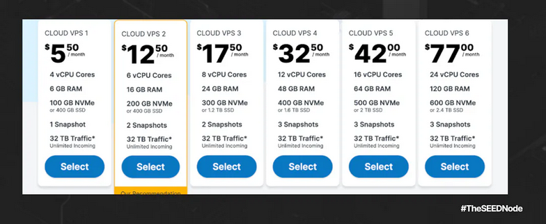

Una vez seleccionado el tipo de plan (Cloud VPS 1), región (Alemania) y almacenamiento (400 GB); vamos a ‘Aplicaciones y paneles’ > Docker

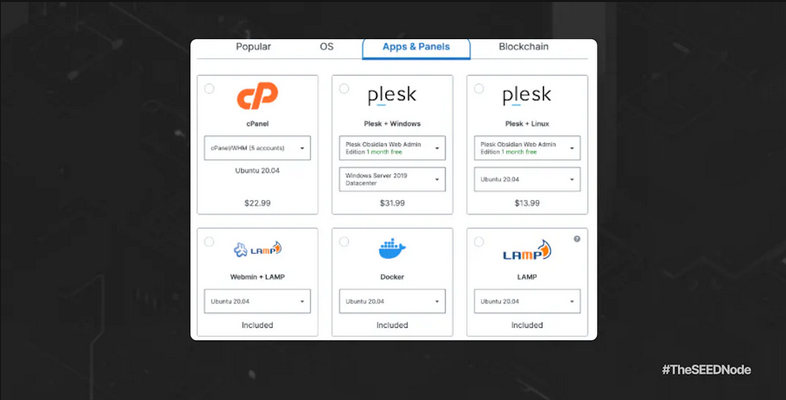

Iniciamos sesión con usuario y contraseña:

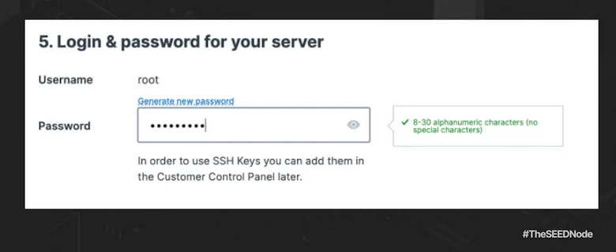

Y por último, antes de pagar, configuramos el almacenamiento (predeterminado), redes (predeterminada) y complementos (predeterminado).

Posterior a todo esto, vamos a instalar [puTTy](https://www.putty.org/) , pueden hacerlo desde Windows descargando desde la web, o en terminal Ubuntu con los siguientes pasos:

```bash
sudo add-apt-repository universe
```

Agregas los repositorios con el siguiente comando.

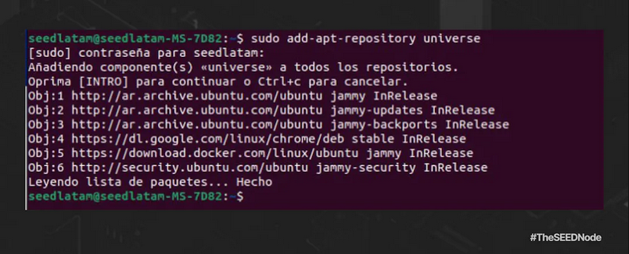

```bash
sudo apt update
```

Actualizas con el siguiente comando.

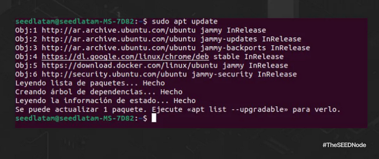

```bash
sudo apt install putty
```

Instalas putty con el siguiente comando.

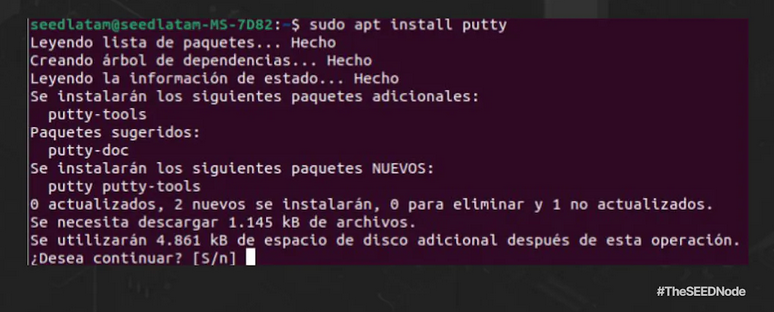

Vamos a actividad y buscamos ‘SSH’, abrimos:

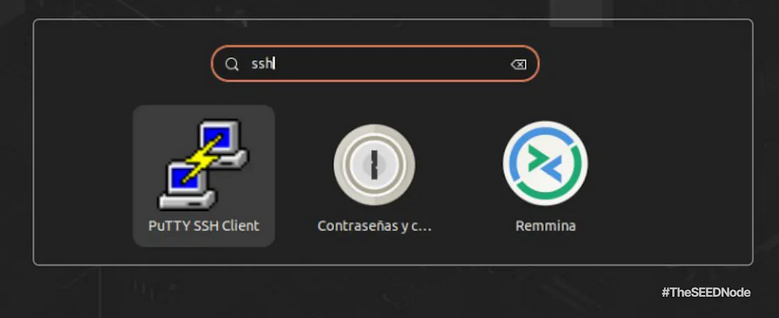

Ingresas la dirección IP del VPS y luego haga clic en OPEN

* Login: root
* Password: (es la que configuraste anteriormente en Contabo VPS)

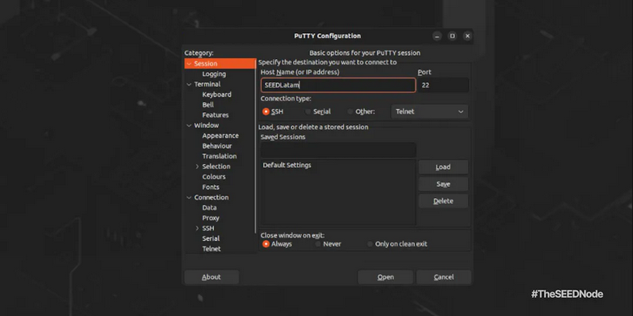

## Parte1: Preparación del Nodo

**Cómo instalar los componentes esenciales:**

```bash
sudo apt update && sudo apt -y upgrade
```

Este comando se encarga de actualizar la lista de paquetes disponibles en los repositorios, y si eso se realiza correctamente, procede a actualizar todos los paquetes instalados en el sistema.

Alternativas según el sistema:

* En sistemas basados en Red Hat (como CentOS o Fedora): `sudo dnf update -y`
* En sistemas basados en Arch Linux: `sudo pacman -Syu --noconfirm`
* En sistemas basados en SUSE (como openSUSE): `sudo zypper refresh && sudo zypper update -y`

Desglose del comando principal:

* **sudo:** Permite a un usuario ejecutar un comando como el superusuario (root). En este caso, se está utilizando para ejecutar los comandos apt con privilegios de superusuario.
* **apt:** Sistema de gestión de paquetes en distribuciones basadas en Debian, como Ubuntu. Este comando se utiliza para instalar, actualizar y administrar paquetes en el sistema.
* **update:** Este subcomando de apt se utiliza para descargar la información más reciente sobre los paquetes disponibles. Es esencial ejecutar esto antes de realizar una actualización para asegurarse de que la información sea la más reciente.
* **&&:** Es un operador lógico que significa "y". En este contexto, se utiliza para ejecutar el siguiente comando solo si el primero se ejecuta correctamente. Si el comando anterior (sudo apt update) tiene éxito, entonces se ejecutará el siguiente comando.
* **sudo apt -y upgrade:** Este es el comando de actualización propiamente dicho. -y se utiliza para confirmar automáticamente cualquier pregunta que el sistema pueda hacer durante el proceso de actualización. La opción upgrade se encarga de instalar las nuevas versiones de los paquetes ya instalados en el sistema.

**Instalemos códigos esenciales**

```bash
sudo apt install pkg-config curl git-all build-essential libssl-dev libclang-dev ufw
```


Instalará todos estos paquetes en el sistema, asegurando que estén disponibles para su uso posterior en la compilación, desarrollo y configuración del sistema.

Alternativas según el sistema:

* En sistemas basados en Red Hat (como CentOS o Fedora): `sudo dnf install pkgconfig curl git-all gcc-c++ openssl-devel clang ufw`
* En sistemas basados en Arch Linux: `sudo pacman -S pkg-config curl git base-devel openssl clang ufw`
* En sistemas basados en SUSE (como openSUSE): `sudo zypper install pkg-config curl git gcc-c++ libopenssl-devel libclang-devel ufw`

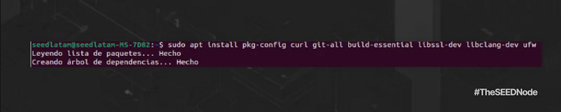

Desglose del comando:
* **install:** Subcomando de apt que se utiliza para instalar nuevos paquetes en el sistema.
* **pkg-config:** Herramienta que se utiliza para devolver la información de configuración necesaria para compilar y vincular programas que utilizan bibliotecas.
* **curl:** Herramienta de línea de comandos para transferir datos con URL. Se utiliza comúnmente para descargar archivos desde la web.
* **git-all:** Paquete que incluye todas las herramientas de Git, un sistema de control de versiones distribuido.
* **build-essential:** Paquete que instala los elementos esenciales necesarios para compilar programas en Linux, como el compilador GCC y otras herramientas de compilación.
* **libssl-dev:** Biblioteca de desarrollo para OpenSSL, que se utiliza para implementar protocolos criptográficos seguros.
* **libclang-dev:** Biblioteca de desarrollo para Clang, un conjunto de herramientas de compilación basado en LLVM.
* **ufw:** Unfront-end para iptables, el sistema de filtrado de paquetes de Linux. UFW facilita la configuración de reglas de firewall.
* Avanzamos colocando ‘Y’ luego del comando.

Comprobamos si Docker está instalado:

```bash
docker version
```

Si no está instalado, ejecutamos:

```bash
sudo apt-get install ca-certificates curl gnupg lsb-release 
```

Asegurar que el sistema tenga instalados los certificados de autoridad necesarios, herramientas para descargar archivos desde la web (curl), herramientas de encriptación y firma digital (gnupg), y la capacidad de obtener información sobre la distribución Linux (lsb-release).

**Alternativas según el sistema:**

* En sistemas basados en Red Hat (como CentOS o Fedora): `sudo dnf install ca-certificates curl gnupg lsb`
* En sistemas basados en Arch Linux: `sudo pacman -S ca-certificates curl gnupg lsb-release`
* En sistemas basados en SUSE (como openSUSE): `sudo zypper install ca-certificates curl gpg2 lsb-release`

Desglose del comando:

* **apt-get:** Similar a apt, es un front-end para el sistema de gestión de paquetes APT (Advanced Package Tool) en sistemas basados en Debian.
* **ca-certificates:** Este paquete incluye certificados de autoridad (CA) que son utilizados por diversas aplicaciones para verificar la autenticidad de las conexiones seguras (HTTPS).
* **curl:** Herramienta de línea de comandos para transferir datos con URL. Se utiliza comúnmente para descargar archivos desde la web.
* **gnupg:** El paquete GnuPG proporciona herramientas para la encriptación y firma digital de datos, y se utiliza comúnmente para verificar la autenticidad de paquetes descargados.
* **lsb-release:** Este paquete proporciona el comando lsb_release, muestra información sobre la distribución Linux en uso.

Ahora agregamos la clave GPG oficial de Dockers:

```bash
sudo mkdir -p /etc/apt/keyrings
curl -fsSL https://download.docker.com/linux/ubuntu/gpg | sudo gpg --dearmor -o /etc/apt/keyrings/docker.gpg
```

Alternativas según el sistema:

* Sistemas basados en Red Hat (como CentOS o Fedora):

`sudo mkdir -p /etc/pki/rpm-gpg curl -fsSL https://download.docker.com/linux/ubuntu/gpg`

`sudo gpg --dearmor -o /etc/pki/rpm-gpg/docker.gpg`

Desglose del comando:

* **sudo mkdir -p /etc/apt/keyrings:** Crea un directorio llamado "keyrings" dentro de "/etc/apt". La opción -p garantiza que se creen directorios padre si no existen.
* **curl -fsSL https://download.docker.com/linux/ubuntu/gpg:** Descarga la clave GPG de Docker desde la URL proporcionada. La opción -fsSL garantiza una descarga silenciosa y segura.
* **sudo gpg --dearmor -o /etc/apt/keyrings/docker.gpg:** Utiliza GPG para desarmar la clave descargada y guarda el resultado en un archivo llamado "docker.gpg" dentro del directorio "/etc/apt/keyrings".

Luego para configurar Repositorio: sólo debemos copiar y pegar.

```bash
echo \
  "deb [arch=$(dpkg --print-architecture) signed-by=/etc/apt/keyrings/docker.gpg] https://download.docker.com/linux/ubuntu \
  $(lsb_release -cs) stable" | sudo tee /etc/apt/sources.list.d/docker.list > /dev/null
```

Desglose de comandos:

* **"deb [arch=$(dpkg --print-architecture) signed-by=/etc/apt/keyrings/docker.gpg] https://download.docker.com/linux/ubuntu $(lsb_release -cs) stable":** Construye la línea de configuración del repositorio de Docker. Aquí hay una desglose de los elementos clave:
* **[arch=$(dpkg --print-architecture) signed-by=/etc/apt/keyrings/docker.gpg]:** Especifica la arquitectura del sistema y la ubicación de la clave GPG para verificar la autenticidad de los paquetes.
* **https://download.docker.com/linux/ubuntu:** La URL del repositorio de Docker para Ubuntu.
* **$(lsb_release -cs):** Sustituye esto con el nombre del código de versión de Ubuntu en uso (por ejemplo, "focal" para Ubuntu 20.04).
* **stable:** Indica que se utilizará la rama "stable" del repositorio de Docker
* **sudo tee /etc/apt/sources.list.d/docker.list:** Utiliza tee con sudo para escribir la línea de configuración del repositorio en el archivo
* **"/etc/apt/sources.list.d/docker.list":** Esto añade la configuración de Docker a las fuentes de apt.
* **> /dev/null:** Redirige la salida estándar (que sería la línea de configuración) a la nada (es decir, descartando la salida), evitando así que se muestre en la terminal.

Aquí es importante otorgar permiso al archivo Docker por si acaso, antes de actualizar el índice del paquete.

```bash
sudo chmod a+r /etc/apt/keyrings/docker.gpg
```

Ajusta los permisos del archivo GPG de Docker para permitir que todos los usuarios del sistema puedan leerlo. Esto es necesario para que el sistema pueda utilizar la clave GPG durante el proceso de actualización de apt

```bash
sudo apt-get update
```

Actualiza la lista de paquetes disponibles en los repositorios configurados en el sistema

Desglose de comandos:

* **chmod a+r /etc/apt/keyrings/docker.gpg:** Modifica los permisos del archivo "/etc/apt/keyrings/docker.gpg" para que sea legible (readable) por todos los usuarios (a+r significa "dar permisos de lectura a todos").

Después de otorgar, índice actualizado, queda instalar la última versión de docker:

```bash
sudo apt-get install docker-ce docker-ce-cli containerd.io docker-compose-plugin
```

Alternativas, aquí tienes algunos ejemplos para otras distribuciones:

* En sistemas basados en Red Hat (como CentOS o Fedora: `sudo dnf install docker-ce docker-ce-cli containerd.io docker-compose`
* En sistemas basados en Arch Linux: `sudo pacman -S docker docker-compose`
* En sistemas basados en SUSE (openSUSE): `sudo zypper install docker docker-compose`

Ahora instalar Docker componer:

```bash
sudo apt install docker-compose
```

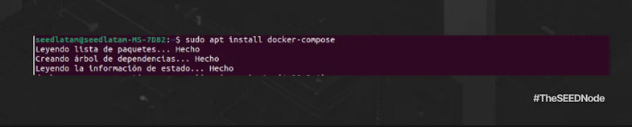

Verificamos si la **INSTALACIÓN DEL MOTOR**tiene éxito ejecutando el hello-world:

```bash
sudo docker run hello-world
```

Desglose de comandos:

* **docker run:** Inicia la ejecución de un contenedor Docker a partir de una imagen.
* **hello-world:** Especifica el nombre de la imagen del contenedor que se utilizará. En este caso, "hello-world" es una imagen de Docker simple y ligera que se utiliza comúnmente para verificar si la instalación de Docker funciona correctamente.

Deberíamos conseguir ver esto:

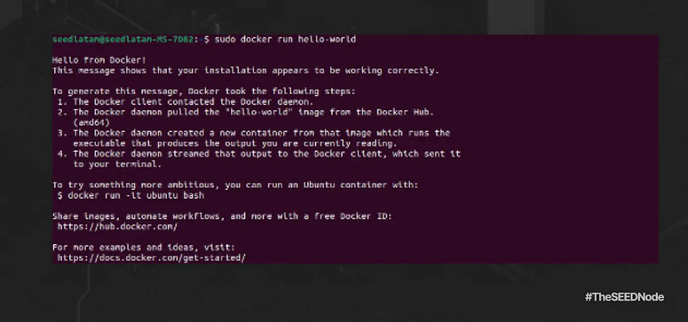

Ahora comprobamos Docker componer versión:

```bash
docker-compose -v
```

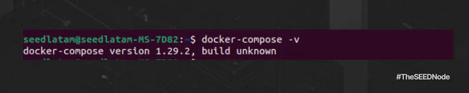

## Parte 2: Instalación del Nodo

**Instalamos el SCREEN**

```bash
sudo apt install screen
```

Creamos una nueva session:

```bash
sudo screen -S taiko
```

**Descargar Nodo:**

```bash
git clone https://github.com/taikoxyz/simple-taiko-node.git
cd simple-taiko-node
```

**Configuración:**

```bash
cp .env.sample .env
```

Editamos la configuración:

```bash
nano .env
```

Editamos el archivo:

Ejemplo:

```bash
< L1_ENDPOINT_HTTP=https://rpc.sepolia.org/
< L1_ENDPOINT_WS=wss://ethereum-sepolia.blockpi.network/v1/ws/56f9eaZZZZZZZZZZZZZZZZZZZZZZZZZZ
< ENABLE_PROVER=false
< L1_PROVER_PRIVATE_KEY=f3982a81dc1372d731b6YYYYYYYYYYYYYYYYYYYYYYYYYYYYYYYYYYYYYYYYYYYYYYYYYYY
< PROVE_BLOCK_TX_GAS_LIMIT=2500000
< MIN_ACCEPTABLE_PROOF_FEE=10
< ENABLE_PROPOSER=true
< L1_PROPOSER_PRIVATE_KEY=9125dbab06f560546688b7a5f1551cdd36bbXXXXXXXXXXXXXXXXXXXXXXXXXXXXXXXXX
< L2_SUGGESTED_FEE_RECIPIENT=0xE2fa3e074b9A804cb082DE23dMMMMMMMMMMMMMMMMMMMMMMMMMMMMMMMMMMMMMMM
< PROPOSE_BLOCK_TX_GAS_TIP_CAP=20000000000
< BLOCK_PROPOSAL_FEE=10
< PROVER_ENDPOINTS=
```

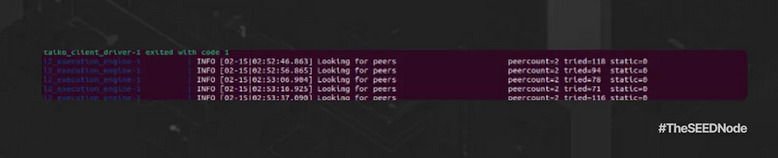

Iniciamos el nodo:

```bash
docker compose up
```

Chequeamos los Logs:

```bash
docker compose logs -f
```

Esperamos unos minutos a que sincronicen los bloques y luego vamos al navegador y tipeamos: http://localhost:3001/d/L2ExecutionEngine/l2-execution-engine-overview

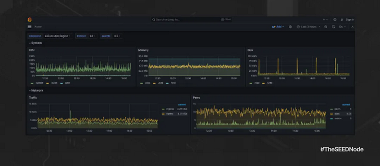

_Disclaimer: El server contratado es a modo de ejemplo, se puede utilizar cualquier otro que quieras. SEEDNode no se hace responsable por la adquisición de este servicio como así tampoco recibe ningún incentivo del mismo._

**Advertencia de Taiko sobre el uso de endpoints L1 de Holesky:** Taiko advierte a los usuarios que al usar un endpoint L1 de Holesky, este debe estar conectado a un nodo archivador para acceder al state trie más allá de los últimos 128 bloques.Se recomienda ejecutar un nodo local de Holesky, aunque también es posible buscar otros proveedores de RPC. Sin embargo, es importante tener en cuenta que estos proveedores pueden eventualmente limitar la tasa de solicitudes del nodo, lo que podría impedir su sincronización. Se recomienda un nodo L1 local para una configuración adecuada.

Todo el material que se presenta aquí es de acceso público. Para obtener información detallada y seguir los pasos en inglés, se puede visitar la [web oficial.](https://docs.taiko.xyz/guides/run-a-taiko-node)

